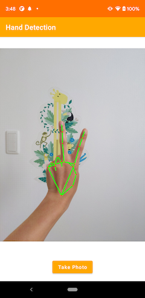

# TensorFlow Lite Hand Detection Android Demo
### Overview
This is an app that uses MediaPipe's [Hands](https://google.github.io/mediapipe/solutions/hands.html) model to detect the hand parts in the frames seen by your device's camera. These instructions walk you through building and running the demo on an Android device. Camera captures are discarded immediately after use, nothing is stored or saved. 



## Build the demo using Android Studio

### Prerequisites

* If you don't have it already, install **[Android Studio](
 https://developer.android.com/studio/index.html)** 4.1 or
 later, following the instructions on the website.

* Android device and Android development environment with minimum API 21.

### Building
* Open Android Studio, and from the `Welcome` screen, select
`Open an existing Android Studio project`.

* From the `Open File or Project` window that appears, navigate to and select
 the `tensorflow-lite/examples/hand_detection/android` directory from wherever you
 cloned the TensorFlow Lite sample GitHub repo. Click `OK`.

* If it asks you to do a `Gradle Sync`, click `OK`.

* You may also need to install various platforms and tools, if you get errors
 like `Failed to find target with hash string 'android-21'` and similar. Click
 the `Run` button (the green arrow) or select `Run` > `Run 'android'` from the
 top menu. You may need to rebuild the project using `Build` > `Rebuild Project`.

* If it asks you to use `Instant Run`, click `Proceed Without Instant Run`.

* Also, you need to have an Android device plugged in with developer options
 enabled at this point. See **[here](
 https://developer.android.com/studio/run/device)** for more details
 on setting up developer devices.

## Integrate to your app

Hand detection logic is implemented in classes inside the package `org.tensorflow.lite.examples.handdetection`. Follow these steps to integrate the model into your own app.

1. Copy the TFLite models (`palm_detection.tflite`  and `hand_landmark.tflite`) to your app's `assests` folder.

2. Add these dependencies to your app's `build.gradle` file:
    * `implementation 'org.tensorflow:tensorflow-lite-support:0.2.0'`
    * `implementation 'org.tensorflow:tensorflow-lite-gpu:2.5.0'`

3. Copy all files under the `org.tensorflow.lite.examples.handdetection.handlandmark` package to your app.

4. Initialize a hand detector instance:

```kotlin
val detector = HandDetector.create(this)
```

5. Detect hand landmarks:
```kotlin
val landmarks = detector.process(bitmap)
// Do something with the landmarks
```

6. Close the hand detector once completed:
```kotlin
detector.close()
```

### Model used
Downloading, extraction and placement in assets folder has been managed
 automatically by `download.gradle`.

If you explicitly want to download the model, you can download it from here:
* [Palm detection model](https://github.com/google/mediapipe/raw/master/mediapipe/modules/palm_detection/palm_detection.tflite)
* [Hand landmark detection model](https://github.com/google/mediapipe/raw/master/mediapipe/modules/hand_landmark/hand_landmark.tflite) 
 
### Additional Note
_Please do not delete the assets folder content_. If you explicitly deleted the
 files, then please choose `Build` > `Rebuild` from menu to re-download the
 deleted model files into assets folder.

